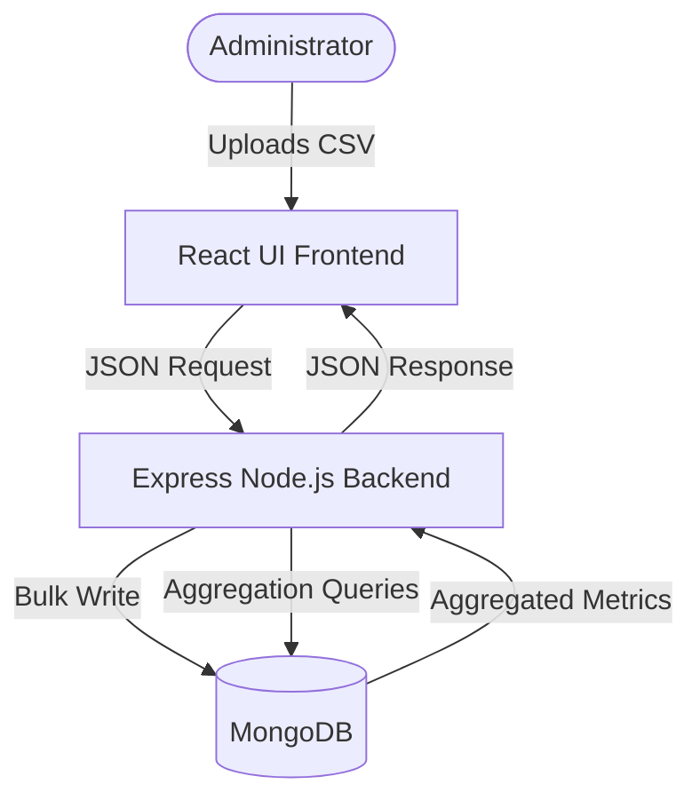

# Technical Architecture & System Design

This document details the system design, database schemas, API routes, and analytics algorithms implemented in the **AI Sales Insights Dashboard** for Mediwave Life Sciences Pvt Ltd.

---

## 1. System Architecture

The application is structured as a standard MERN stack system:



* **Frontend:** React + Vite, Recharts, and Lucide React. It uses a single-page tabs configuration to toggle views.
* **Backend:** Node.js + Express.js. Utilizes Multer for file storage staging, and stream processing with `csv-parser` to parse records with low memory overhead.
* **Database:** MongoDB + Mongoose. Indexes are built on fields like `date`, `product`, and `region` to accelerate analytics computations.

---

## 2. CSV Import Pipeline

The backend handles imports dynamically to reduce memory usage and support large sales sheets:

1. **Multer Staging:** The CSV file is posted to `POST /api/upload`, and saved to `backend/uploads/` with a temporary timestamp prefix.
2. **Chunked Stream Parsing:** `fs.createReadStream` pipes the file stream directly into `csv-parser`. This parses row-by-row and avoids loading the entire file into server RAM.
3. **Property Normalization:** The parser checks for case variations (e.g. `UnitsSold`, `units_sold`, `UNITS_SOLD`) to remain compatible with different sheet exports.
4. **Bulk Database Insert:** Validated records are pushed into a collection array and written to MongoDB in a single `insertMany` bulk operation, which is up to 10x faster than individual saves.
5. **Disk Cleanup:** Regardless of success or failure, the temporary CSV is immediately unlinked (`fs.unlinkSync`) to prevent storage leakage.

---

## 3. Analytics & Insights Generation Formulas

### Dynamic KPIs
The backend retrieves totals dynamically:
* **Total Revenue:** $\sum (\text{unitsSold} \times \text{unitPrice})$
* **Units Sold:** $\sum (\text{unitsSold})$
* **Total Transactions:** Count of documents in the collection.
* **Average Order Value (AOV):** $\frac{\text{Total Revenue}}{\text{Total Transactions}}$

### Monthly Sales Trend
Groups sales by year and month:
```javascript
{
  $group: {
    _id: { year: { $year: "$date" }, month: { $month: "$date" } },
    revenue: { $sum: "$revenue" }
  }
}
```

### Declining Products
We implement a rule-based statistical approach to identify declining product lines.
1. The backend finds the maximum date in the database: $D_{\text{latest}}$.
2. Stretches two periods:
   * **Recent 30 Days (Period A):** $[D_{\text{latest}} - 30 \text{ days}, D_{\text{latest}}]$
   * **Previous 30 Days (Period B):** $[D_{\text{latest}} - 60 \text{ days}, D_{\text{latest}} - 30 \text{ days})$
3. Calculates total revenue per product in Period A ($R_A$) and Period B ($R_B$).
4. If $R_A < R_B$, calculates the percentage drop:
   $$\text{Drop \%} = \frac{R_B - R_A}{R_B} \times 100$$
5. Products with a drop percentage greater than **10%** are flagged as "Declining Products".

### Weak Markets
Calculates the total revenue of the system ($T_R$) and the revenue for each region ($r_R$). Any region whose contribution:
$$\frac{r_R}{T_R} \times 100 < 15\%$$
is flagged as a **Weak Market** to highlight underperforming territories.
